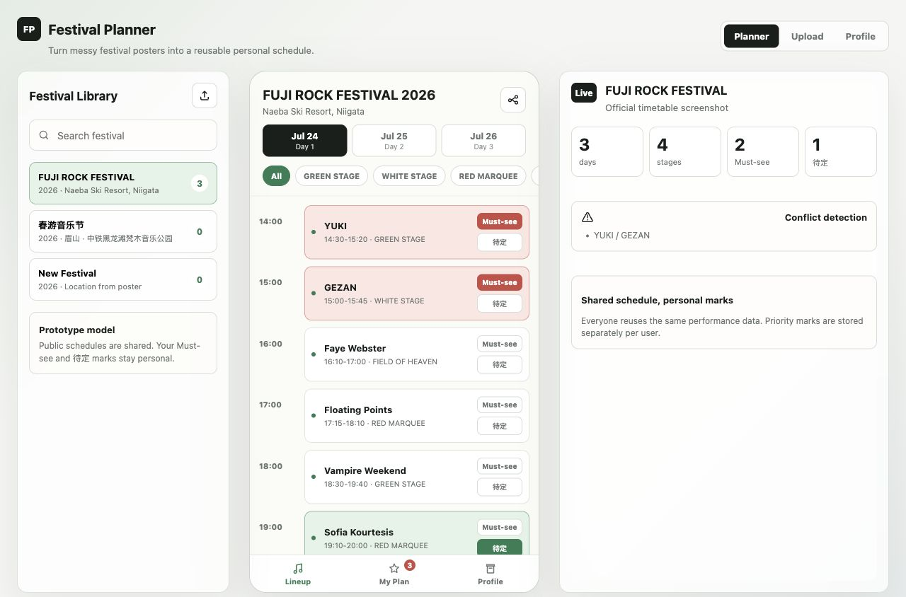

# Fuji Rock 2026 Planner

[](https://vercel.com)
[](LICENSE)

> 一份给 **FUJI ROCK FESTIVAL 2026** 的观演计划工具。把 158 组演出标成必看 / 待定，自动算撞场，最后一键生成可以发朋友圈的分享海报。

🎟 **在线访问**：_部署后填上你的 Vercel URL_

<p align="center">
  
</p>

## ✨ 特性

- **官方 158 组演出** · 来自 [fujirockfestival.com](https://en.fujirockfestival.com) 的完整时间表（3 天 × 8 个舞台），每个艺人卡片可直接跳转官网详情。
- **必看 ★ / 待定 ?** · 一秒标记，刷阵容时不用切换页面。
- **撞场自动提醒** · 两个必看撞了会显示 ⚠ 冲突；待定撞了也会提示。
- **My Top Pick** · 最多 3 组「最想看的音乐人」会出现在分享海报的 C 位。
- **一键出海报** · 横版多日时间表分享图，I'M GOING TO FUJI ROCK，发朋友圈/微博/Instagram 都好看。
- **纯前端** · 数据保存在 `localStorage`，不上传任何信息，无需账号。
- **Mobile-first** · 手机浏览器就是主战场，桌面也能用。

## 🚀 本地运行

```bash
git clone https://github.com/<your-username>/fuji-rock-planner.git
cd fuji-rock-planner
npm install
npm run dev
```

打开 `http://localhost:5173` 就能用。`npm run dev` 默认监听 `0.0.0.0`，所以同 Wi-Fi 下手机也能直接访问 `http://<你的电脑 IP>:5173`。

## 🌐 部署到 Vercel

1. 在 GitHub 上 fork 本仓库；
2. 登录 [vercel.com](https://vercel.com) → Add New Project → Import 这个仓库；
3. Framework Preset 选 **Vite**，其它保持默认，点 Deploy；
4. 几十秒后会拿到一个 `*.vercel.app` 的链接，发出去就能用。

也可以一键部署：

[](https://vercel.com/new/clone?repository-url=https://github.com/<your-username>/fuji-rock-planner)

## 🧰 技术栈

- React 19 + Vite 8（SPA，纯前端）
- html2canvas（分享图渲染）
- 无后端、无数据库、无埋点

## 🗂 项目结构

```
src/
├── App.jsx              # 入口，直接渲染 Fuji Rock
├── screens/
│   └── FestivalScreen.jsx
├── components/
│   ├── LineupList.jsx   # 按时间分组的阵容
│   ├── MyPlanList.jsx   # 必看清单 + 分享 + 头牌槽位
│   └── ShareCanvas.jsx  # 分享海报渲染
├── data/seed.js         # 158 组官方演出数据
├── lib/                 # storage / conflicts / time / stages
└── styles.css
```

## 🎨 想加入其它音乐节？

这个仓库是 [festival-planner-prototype](#) 项目专为 Fuji Rock 裁剪的发布版。完整版（带"添加新音乐节"+海报识别）在原仓库里持续开发。欢迎 fork 改造成你自己的音乐节版本——把 `src/data/seed.js` 换掉即可。

## 📄 License

[MIT](LICENSE) © 2026

随便用、随便改、随便发，注明出处即可。
